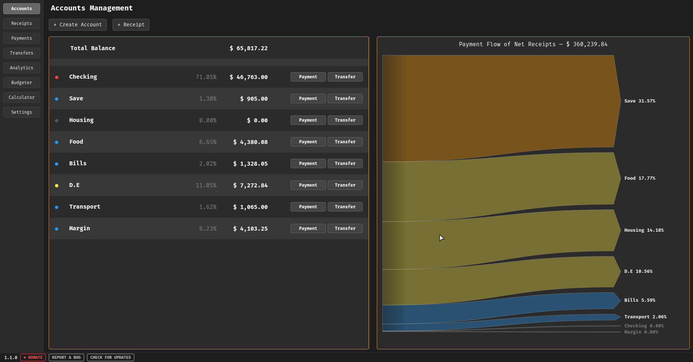

# TallyBook

A fast, local-first finance ledger for Linux

TallyBook is a desktop financial ledger application. It provides a comprehensive double-entry bookkeeping system for tracking personal or small business finances, wrapped in a dark-themed interface.

## ⤑ Quick Start

**Download** — Get the latest `TallyBook-x86_64.AppImage` from the [GitHub Releases](https://github.com/DOCKPORT/TallyBook/releases) page. Save it in a dedicated folder like `~/Applications`.

**Make Executable** — Open a terminal in the folder and run:
```
chmod +x TallyBook-x86_64.AppImage
```

**Launch** — Double-click the file. On first run it will automatically create your database and optionally integrate with your desktop environment.

**Updates** — Download the newest AppImage and replace your old one. Your ledger data is stored separately and will be found automatically.

## ⤑ Features

- Account Management
- Receipts & Payments
- Fund Transfers
- Per-Account Ledger
- Monthly Analytics
- Sankey Flow Diagram
- Budget Planner
- Terminal Calculator
- CSV Export
- Backup & Restore
- Dark Theme
- Custom Currency

## ⤑ Screenshot



---

© 2025 DockPort — dockport_dev@protonmail.com · [dockport.github.io/tallybook](https://dockport.github.io/tallybook)